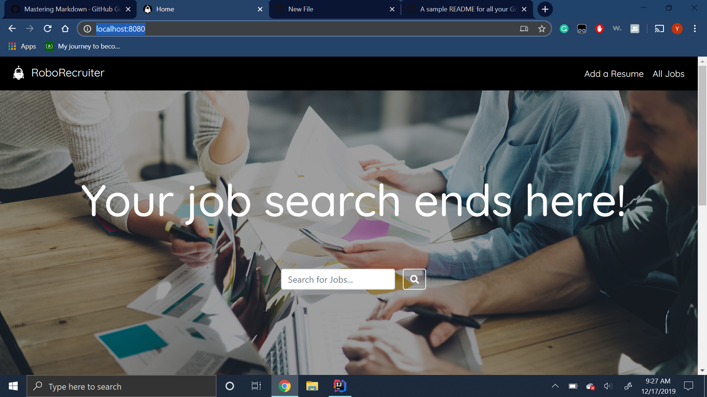
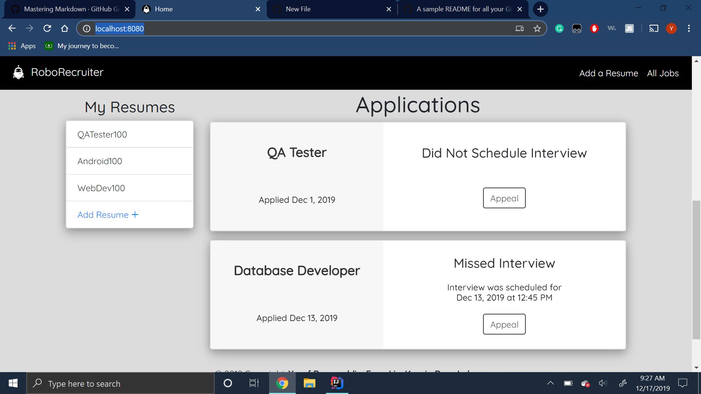

# RoboRecruiter

## User Guide
To test the application, please follow this workflow for a smooth and interesting experience...
1. navigate to our app on [heroku](https://immense-waters-80613.herokuapp.com/)
2. log in as `user` with password `user`
3. apply to a job
    - navigate to `All Jobs` (upper right)
    - first, click `Apply` for the `Android Developer` job. To experience the app behavior when your resume *does not pass* the initial screen, select the `Android75` resume. Scroll down on the home screen to see the result.
    - second, go back to `All Jobs` and `Apply` for another available job. Be sure to select a resume with a *matching name*. Scroll down on the home screen to see that you were *accepted*.
4. schedule an interview
    - scroll down to the job where you *accepted*, and click on `Schedule Interview`
    - if you wish, experience some data validation by...
        - entering a date in the past
        - entering today's date with time that has already passed
        - entering a date that is more than two weeks in the future
    - finally, enter today's date and a time which is just a minute or two in the future
5. appeal a decision
    - select a pre-existing `Appeal` condition, this can be either for...
        - an interview you did not schedule (you missed the two week window), or
        - an interview which you scheduled but missed (you didn't begin the questionnaire in the 30-minute window)
    - enter an appeal and click `Submit`. Your appeal has been emailed!
6. take an interview
    - it should now be time to take your interview!
    - go ahead and take the interview. Enter an answer for each question, and hit submit.
7. add some resumes
    - add some .txt files to your resume bank, and experience some data validation if you attempt to add a file without a .txt extension.
8. play with the search function
    - be sure to enter an impossible search, such as `asdf`, to meet our **cute mascot** redirecting you home.

That's all, folks!

## Caveat Emptor

This heroku-hosted application is relatively stateful, so if you 'use up' all the pre-loaded data by applying with the 'wrong' resumes and get rejected from all possible jobs, you'll need to wait approximately one day before trying this workflow again, as heroku automatically resets the application about once each day.

On the other hand, you can always clone the repo and run it locally!

## Application Overview

Our application is a job board that automates some of the preliminary aspects of the interview process (resume screening, preliminary
interview questions) in an effort to save both employers and prospective employees time and money.

In our application users first are allowed to submit one or many text resumes. They can then search through the available jobs and apply to those they want to with one of the resumes they submitted. Once they apply, their resume is scanned for keywords and if there is an 80% match from the corresponding job's keyword list, their applicaton is accepted and they are allowed to schedule an online interview. If their resume does not contain enough keywords they are rejected immediately.

The applicant is given a __2 week window__ in which they must schedule and take the interview. Should they login within the designated interview time, a pop-up will appear letting them know it is time to conduct the interview. Once the applicant completes the interview, the responses are sent to the hiring manager via email.

If the applicant fails to conduct the interview or misses the interview time frame, they are allowed to send an appeal email to the hiring manager with an explanation as to why.

The main technologies we used to develop our applicaton are Java, Thymeleaf, Spring MVC, HTML/CSS, Bootstrap, and H2/SQL.

## Further Expansion/Testing
Some features we talked about but haven't yet implemented are hiring manager functionality, allowing them to login, view relevant applications, and make decisions about appeals/offers. One way we could do this is to implement an in-application inbox that allows them to view all the relevant information inside the apllication itself.

Our program is currently written with H2 but it is able to run using MySQL given one changes the application.properties file.
